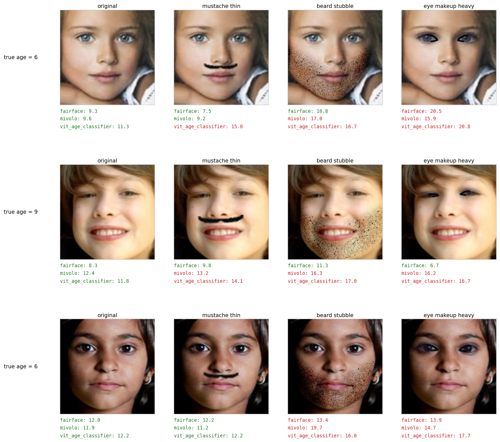
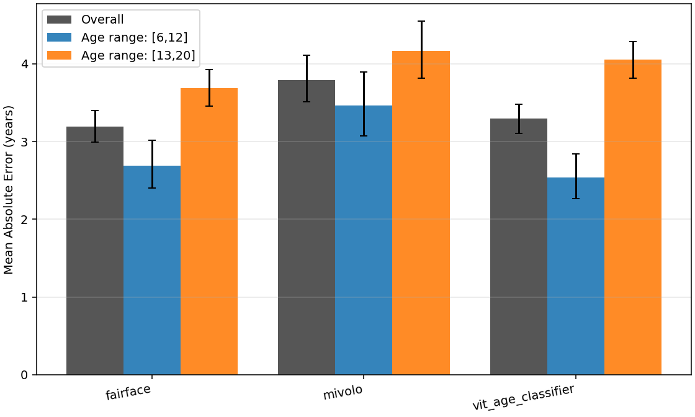
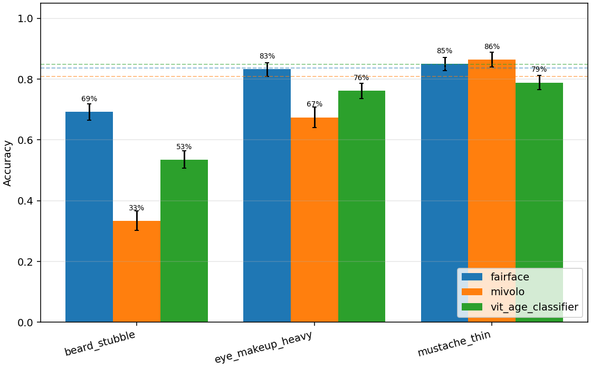
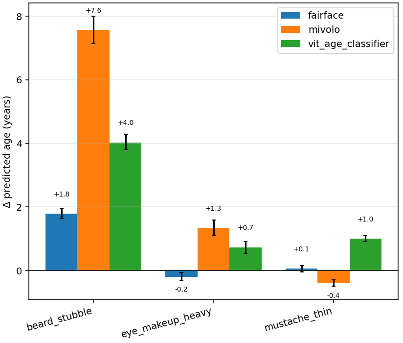
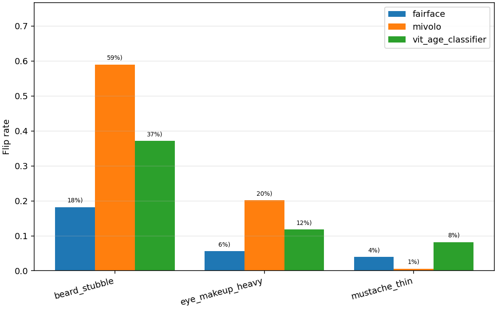

## The problem

Online platforms increasingly rely on automated age estimation to enforce minimum-age policies. Meta, for instance, requires users to be at least 13 to open an Instagram or Facebook account, and has rolled out AI-based age verification to catch underage users who lie about their date of birth. 

If a 10-year-old uploads a photo, the model should flag them as under 13 and block the account. But what happens if that same child grabs a black marker, draws a beard or mustache, and tries again? In this post we run the experiments to answer this question.

## The setup

We tested three widely used age estimators that are representative of what's available off-the-shelf today:

- **FairFace** ([repo](https://github.com/joojs/fairface)) — a well-known face-attribute model often used as a baseline in fairness research.
- **MiVOLO** ([repo](https://github.com/wildchlamydia/mivolo)) — a strong recent age-and-gender transformer.
- **ViT Age Classifier** ([Hugging Face](https://huggingface.co/nateraw/vit-age-classifier)) — a Vision Transformer for age classification, popular in Hugging Face.

For the data, we used [UTKFace](https://susanqq.github.io/UTKFace/), a standard age-estimation benchmark with ground-truth ages. We worked with two slices:

- **Set A (1,000 samples)** balanced between ages 6–12 and 13–20 — used to characterize the overall performance of each model around the 13-year-old threshold that platforms care about.
- **Set B (1,050 samples)** of minors aged 6–12 — the population we want to protect. This is where we apply manipulations and measure how often a minor gets misclassified as an adolescent or adult (>12-year-old).

For the manipulations, we deliberately stayed in the world of *what a child could actually do at home*. No generative AI, no diffusion-based aging, no deepfakes. Just classic OpenCV image edits that mimic things you could draw on your face with a marker or some makeup:

- `mustache_thin` — a thin dark mustache drawn above the upper lip.
- `beard_stubble` — a sparse stubble texture on the lower face.
- `eye_makeup_heavy` — darkened eyeshadow and liner around the eyes.

Here is what these look like applied to three real UTKFace minors, with each model's predicted age underneath (green = correctly classified as a minor, red = flipped to non-minor):

The girl in the top row is 6 years old. With a thin mustache drawn on, ViT Age Classifier already predicts 15. With stubble, two of the three models cross 13. With heavy eye makeup, all three do. The other rows tell similar stories. 

## Results

### Baseline: the models are competitive on clean images

Before we manipulate anything, the three models perform broadly similarly on Set A. Mean absolute error on the overall set is between 3.2 and 3.8 years, with all three models actually doing slightly *better* on the minor sub-population (MAE 2.5–3.5 years) than on the adult one. Overall, the considered models perform well on the age-groups of our interest.

### Binary accuracy collapses under manipulation

The task that matters for platforms is binary: is this user under 13, or not? On Set B (minors only), each model's accuracy on this binary task on *unmanipulated* images is around 80–85% — the dashed lines in the chart below.

Now look at what happens when we apply each manipulation:

The `mustache_thin` manipulation barely moves the needle — accuracy stays at 79–86%. But `beard_stubble` is devastating: MiVOLO drops from 81% to **33%**, ViT Age Classifier from 84% to **53%**, and even the most robust model, FairFace, loses 15 percentage points. `eye_makeup_heavy` sits in between, with MiVOLO again the most affected (down to 67%).

To be clear about what 33% means in this context: when a minor draws stubble on their face, MiVOLO is *worse than a coin flip* at recognizing them as a minor.

### How much older do the manipulations make the children look?

Binary accuracy hides the magnitude of the shift. The chart below shows the average change in predicted age (manipulated minus original) per model and manipulation:

Stubble pushes MiVOLO's prediction up by **7.6 years on average**, and ViT Age Classifier by **4.0 years**. Eye makeup and the thin mustache produce smaller shifts (under 1.5 years on average), but as we'll see next, "smaller on average" still flips a lot of children across the threshold.

### Flip rates: how often does a minor get reclassified as ≥13?

Of the minors the model originally classified as under 13, what fraction does it now classify as ≥13 after we apply the manipulation? 

For MiVOLO under stubble, **59% of correctly-classified minors flip to adult**. ViT Age Classifier flips 37%. FairFace, the most robust here, still flips 18% — roughly one in five.

Eye makeup flips 6–20% of minors depending on the model. Even the less impactful manipulation, i.e., thin mustache flips up to 8%.

## Why this matters

**Platforms relying on these models as a meaningful safety layer are protected by a thinner margin than they probably realize**. A 10-year-old who wants an Instagram account does not need a deepfake, a diffusion model, or any technical skill. They need a marker and three minutes in front of a mirror.

Our results point to the following technical recommendations::

- **Age estimation should not be a single-layer defense.** It should be combined with behavioral signals, network signals, and human review for borderline cases — and the binary threshold should be treated as a probabilistic estimate.
- **Robustness to trivial physical manipulations should be a benchmark.** Right now, age models are evaluated on clean test sets. The relevant test set for deployment is one in which the adversary is a motivated minor.
- **The most accurate model is not necessarily the safest choice.** Methodologies on spurious correlation biases, shortcut learning, and out-of-distribution generalization are directly relevant to this task and should be employed to enhance the robustness of such models.

We are releasing the manipulation pipeline and the evaluation scripts for other researchers and platforms to test their own models. If you maintain an age verification system and you need help to audit it in such scenarios, please get in touch.

### Zooming out: Is age verification even the right task?
 
Even if we patched every robustness issue we identified, we would still be left with a more uncomfortable question — whether automated age verification is a meaningful goal in the first place. As [Elisa Lindinger argues for Internet Exchange](https://internet.exchangepoint.tech/see-no-evil-speak-no-evil-hear-no-evil/), the mental-health framing that drives age-gating laws — "children are suffering because of social media" — collapses a complex picture (poverty, climate anxiety, post-pandemic isolation, shrinking unsupervised public spaces) into a single technical fix. Banning a 12-year-old from Instagram does not address why they were on Instagram in the first place. It removes one of the few spaces where many children currently find peers, information, and community, often without offering an alternative. By banning children from social media, we are choosing not to ask social media to change. The design choices that actually drive harm — engagement-maximising recommendation, dark patterns, advertising, feeds optimised for time-on-platform rather than wellbeing — remain untouched at the largest platforms. And much of what is described as harmful to children is harmful to all of us. 
 

---

*This work was carried out by the MeVer group at CERTH-ITI. All manipulations were generated with classic OpenCV operations; no generative AI was involved. The UTKFace dataset is used under its standard non-commercial research license.*
